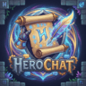

## HeroChat

[](https://github.com/heroslender/HeroChat/stargazers)
[](https://github.com/heroslender/HeroChat/issues)
[](https://github.com/heroslender/HeroChat/commit)
[](https://github.com/heroslender/HeroChat/releases)
[](https://github.com/heroslender/HeroChat/releases/latest)
[](https://discord.gg/nWX7apX)

A simple and customizable chat plugin for Hytale servers.


<!-- TOC -->
  * [HeroChat](#herochat)
    * [Features](#features)
    * [Commands](#commands)
    * [Permissions](#permissions)
    * [Config](#config)
      * [Global config](#global-config)
      * [Private channel config](#private-channel-config)
      * [Channel config](#channel-config)
      * [Messages Config](#messages-config)
    * [Available placeholders](#available-placeholders)
    * [Formatting placeholders](#formatting-placeholders)
    * [Plugin Compatibility](#plugin-compatibility)
      * [LuckPerms](#luckperms)
    * [Screenshots](#screenshots)
<!-- TOC -->

### Features

- [x] Infinite configurable channels
- [x] Proximity channels
- [x] Private chat with other players
- [x] Focus on a specific channel or private chat
- [x] Mute a channel as a player to avoid unwanted chat spam
- [x] Colors, gradients & formatting with bold, italic and monospaced
- [x] Customizable player nicknames with permissions to limit usage of colors and style
- [x] Support for Minecraft color codes(e.g. `&a`, `&l`, etc.)
- [x] Chat spy, see all messages on all channels from the server
- [x] Custom UI for players to easily manage their chat settings
- [x] Custom UI for server admins to customize the plugin with ease
- [x] Permissions to let the players use colors & style on chat messages
- [x] Custom components to allow for reusable placeholders and better organization
- [x] Multiple spam checks including repeated messages & capslock spam
- [x] Chat cooldown configurable per channel
- [x] Support for PlaceholderAPI everywhere in the plugin
- [ ] Player mention system
- [ ] Discord integration & sync
- [ ] URL filter to prevent ads on chat
- [ ] Chat logging to see a player/server history of chat messages

### Commands

- `/chat` - Opens the chat customization menu;
- `/chat settings` - Opens the user settings menu;
- `/chat spy` - Toggle chat spy;
- `/tell <player>` - Change the default chat to this private channel;
- `/tell <player> <message>` - Sends a private message;
- `/nickname set <nickname>` - Changes your nickname;
- `/nickname clear` - Clears your nickname;
- `/<channel-id>` - Change the default chat to this channel;
- `/<channel-id> <message>` - Sends a message in a specific channel

### Permissions

- `herochat.commands.chat` - Permission for player to use the `/chat` command
- `herochat.commands.nickname` - Permission for player to use the `/nickname` command
- `herochat.commands.nickname.set` - Permission for player to use the `/nickname set` command
- `herochat.commands.nickname.clear` - Permission for player to use the `/nickname clear` command
- `herochat.nickname.style.colors` - Permission to use colors on the nickname
- `herochat.nickname.style.rainbow` - Permission to use rainbow on the nickname
- `herochat.nickname.style.gradient` - Permission to use gradient on the nickname
- `herochat.nickname.style.bold` - Permission to use bold on the nickname
- `herochat.nickname.style.italic` - Permission to use italic on the nickname
- `herochat.nickname.style.monospaced` - Permission to use monospaced on the nickname
- `herochat.chat.mute-channels` - Permission for player to mute channels
- `herochat.chat.message-color` - Permission for player to change the default message color on chat
- `herochat.chat.message.colors` - Permission for player to use colors on chat
- `herochat.chat.message.formatting` - Permission for player to use formatting tags on chat
- `herochat.bypass.cooldown` - Permission to bypass the cooldown checks
- `herochat.bypass.spam` - Permission to bypass the spam checks
- `herochat.bypass.capslock` - Permission to bypass the capslock spam checks
- `herochat.admin.spy` - Permission to enable chat spy
- `herochat.admin.settings` - Permission to open the admin settings menu

### Config

You can create as many chat components as you want and need. You can also create components available only on a
specific channel. A channel ID is its file name.

#### Global config

```json
{
  "DefaultChat": "global",
  "enableMinecraftColors": false, // Enable &a, &4, etc colors as in minecraft
  "Components": {
    "prefix": {
      "Text": "{#00ffff}{bold}[HeroChatt]"
    },
    "admin_prefix": {
      "Text": "{#00AAAA}[Admin]",
      "Permission": "tag.admin" // Optional
    }
  }
}
```

#### Private channel config

```json
{
  "Name": "Whisper",
  "Commands": [
    "tell",
    "w",
    "whisper"
  ],
  "SenderFormat": "Message to {target_username}{#555555}{bold}> {#aaa}{message}",
  "ReceiverFormat": "Message from {player_username}{#555555}{bold}> {#AAAAAA}{message}",
  "Permission": "chat.tell", // Optional
  "CapslockFilter": {
    "enabled": true,
    "percentage": 50,
    "minLength": 5
  },
  "Cooldowns": {
    "chat.member": 1000, // Cooldown in miliseconds
    "chat.vip": 300,
    "chat.admin": 0
  },
  "Components": {}
}
```

#### Channel config

```json
{
  "Name": "Local",
  "Commands": [
    "g",
    "global"
  ],
  "Format": "{#FFFF55}[L] {player_username}{#555555}{bold}> {#AAAAAA}{message}",
  "Permission": "chat.local", // Optional
  "Distance": 60, // Optional
  "CrossWorld": false, // Optional
  "CapslockFilter": {}, // Optional - defaults to disabled
  "Cooldowns": {},
  "Components": {}
}
```

#### Messages Config

```json
{
  "ChannelNoPermission": "{#FF5555}You do not have permission to send messages in this channel.",
  "ChannelNotFound": "{#FF5555}Channel not found.",
  "ChannelJoined": "{#55FF55}You are now talking in {#FFFFFF}{channel}{#55FF55}.",
  "ChannelDisabled": "{#FF5555}You have disabled this channel. Enable it again to be able to talk here.",
  "ChatNoRecipients": "{#FF5555}No one hears you.",
  "ChatSpamWarning": "{#FF5555}Please do not spam.",
  "ChatCooldown": "{#FF5555}Please wait before sending another message.",
  "ChatCapslockWarning": "{#FF5555}Please do not abuse capslock.",
  "PrivateChatStarted": "{#55FF55}You are now in a private conversation with {#FFFFFF}{player}{#55FF55}.",
  "PrivateChatPlayerNotFound": "{#FF5555}Player not found.",
  "PrivateChatSelf": "{#FF5555}You cannot start a private conversation with yourself.",
  "PrivateChatNotActive": "{#FF5555}You are not in a private conversation.",
  "SpyNoPermission": "{#FF5555}You do not have permission to use chat spy.",
  "SpyToggle": "{#CCCCCC}Chat spy has been {status}{#CCCCCC}.",
  "NicknameNoPermission": "{#FF5555}You do not have permission to change your nickname.",
  "NicknameTooLong": "{#FF5555}Nickname is too long.",
  "NicknameContainsSpaces": "{#FF5555}Your nickname can not contain spaces.",
  "NicknameSet": "{#55FF55}Your nickname has been set to {#FFFFFF}{nickname}{#55FF55}.",
  "NicknameReset": "{#55FF55}Your nickname has been reset.",
  "MenuFocusedChannel": "Focused Channel",
  "MenuMutedChannels": "Muted Channels",
  "MenuMessageColor": "Message Color",
  "MenuSpyMode": "Spy Mode",
  "MenuSaveButton": "Save",
  "MenuCancelButton": "Close",
  "MenuSuccessNotificationTitle": "Settings Saved",
  "MenuSuccessNotificationDescription": "Your settings were successfully saved!"
}
```

### Available placeholders

If you are using PlaceholderAPI in your server you can use all of [its placeholders](https://wiki.placeholderapi.com/users/placeholder-list/hytale/),
but using the format `{placeholder}`.

Default placeholders available:

- `{message}` - The message to be sent by the player
- `{player_username}` - The player username

### Formatting placeholders

- `{#ffffff}` - Hex color
- `{#ffffff-#aaffaa}` - Gradient text color
- `{rainbow}` - Raibow text color
- `{bold}`
- `{italic}`
- `{monospaced}`

### Plugin Compatibility

#### LuckPerms

To use this plugin with LuckPerms you must disable chat formatting on the LuckPerms config:

```yaml
chat-formatter:
  enabled: false  # <== Change this to false
  message-format: "<prefix><username><suffix>: <message>"
```

### Screenshots


