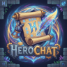

## HeroChat

A simple and customizable chat plugin for Hytale servers.

### Wiki
* [Chat Commands](https://github.com/heroslender/HeroChat/wiki/Commands)
* [Permissions](https://github.com/heroslender/HeroChat/wiki/Permissions)
* [Auto-Moderation](https://github.com/heroslender/HeroChat/wiki/Auto‐Moderation)
* [Main Configuration (config.yml)](https://github.com/heroslender/HeroChat/wiki/Main-Configuration-(%60config.yml%60))
* [Channel Configuration](https://github.com/heroslender/HeroChat/wiki/Channel-Configuration)
* [Private Channel Configuration](https://github.com/heroslender/HeroChat/wiki/Private-Channel-Configuration)

### Features

- [x] Infinite configurable channels
- [x] Proximity channels
- [x] Private chat with other players
- [x] Focus on a specific channel or private chat
- [x] Mute a channel as a player to avoid unwanted chat spam
- [x] Colors, gradients & formatting with bold, italic and monospaced
- [x] Customizable player nicknames with permissions to limit usage of colors and style
- [x] Support for Minecraft color codes(e.g. `&a`, `&l`, etc.)
- [x] Chat spy, see all messages on all channels from the server
- [x] Custom UI for players to easily manage their chat settings
- [x] Custom UI for server admins to customize the plugin with ease
- [x] Permissions to let the players use colors & style on chat messages
- [x] Custom components to allow for reusable placeholders and better organization
- [x] Multiple spam checks including repeated messages & capslock spam
- [x] Chat cooldown configurable per channel
- [x] Chat auto-mod with support for regex
- [x] Players can ignore other players
- [x] Support for PlaceholderAPI everywhere in the plugin
- [ ] Player mention system
- [ ] Discord integration & sync
- [ ] URL filter to prevent ads on chat
- [ ] Chat logging to see a player/server history of chat messages

### Screenshots

